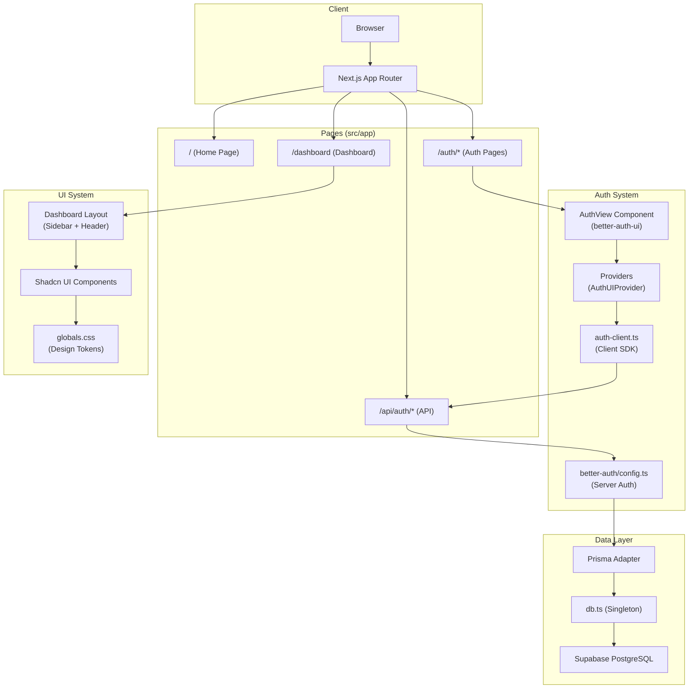

# AirOne Studio — Project Structure Review

> **Stack:** Next.js 15 (App Router) · T3 Stack · Prisma · Supabase (PostgreSQL) · Better Auth · Shadcn UI · Tailwind CSS v4 · TypeScript

---

## Project Tree

```
aironestudio2/
├── prisma/
│   ├── migrations/
│   │   ├── 20260318233024_initial_columns/
│   │   │   └── migration.sql
│   │   └── migration_lock.toml
│   └── schema.prisma
├── public/
│   └── favicon.ico
├── src/
│   ├── app/
│   │   ├── (auth)/
│   │   │   ├── auth/
│   │   │   │   └── [path]/
│   │   │   │       └── page.tsx
│   │   │   └── layout.tsx
│   │   ├── (dashboard)/
│   │   │   ├── dashboard/
│   │   │   │   └── page.tsx
│   │   │   └── layout.tsx
│   │   ├── api/
│   │   │   └── auth/
│   │   │       └── [...all]/
│   │   │           └── route.ts
│   │   ├── layout.tsx
│   │   └── page.tsx
│   ├── components/
│   │   ├── sidebar/
│   │   │   ├── app-sidebar.tsx
│   │   │   └── breadcrumb-page-client.tsx
│   │   ├── ui/
│   │   │   ├── breadcrumb.tsx
│   │   │   ├── button.tsx
│   │   │   ├── input.tsx
│   │   │   ├── mobile-sidebar-close.tsx
│   │   │   ├── separator.tsx
│   │   │   ├── sheet.tsx
│   │   │   ├── sidebar.tsx
│   │   │   ├── skeleton.tsx
│   │   │   ├── sonner.tsx
│   │   │   └── tooltip.tsx
│   │   ├── providers.tsx
│   │   └── sidebar1.tsx
│   ├── hooks/
│   │   └── use-mobile.ts
│   ├── lib/
│   │   ├── auth-client.ts
│   │   ├── auth.ts
│   │   └── utils.ts
│   ├── server/
│   │   ├── better-auth/
│   │   │   ├── client.ts
│   │   │   ├── config.ts
│   │   │   ├── index.ts
│   │   │   └── server.ts
│   │   └── db.ts
│   ├── styles/
│   │   └── globals.css
│   └── env.js
├── .env
├── .env.example
├── .gitignore
├── README.md
├── components.json
├── eslint.config.js
├── generate_tree.ps1
├── next-env.d.ts
├── next.config.js
├── package-lock.json
├── package.json
├── postcss.config.js
├── prettier.config.js
├── start-database.sh
└── tsconfig.json
```

---

## Root Configuration Files

| File | Purpose |
|------|---------|
| [.env](file:///c:/Users/mkhizecj/Desktop/Projectjune/aironeaistudio%20-%20Copy/aironestudio2/.env) | Environment variables (secrets, DB URLs, auth keys). **Gitignored.** |
| [.env.example](file:///c:/Users/mkhizecj/Desktop/Projectjune/aironeaistudio%20-%20Copy/aironestudio2/.env.example) | Template showing required env vars (BETTER_AUTH_SECRET, GitHub OAuth, DATABASE_URL). Committed to version control as a reference. |
| [.gitignore](file:///c:/Users/mkhizecj/Desktop/Projectjune/aironeaistudio%20-%20Copy/aironestudio2/.gitignore) | Specifies files/folders Git should ignore (node_modules, .next, .env, etc.). |
| [README.md](file:///c:/Users/mkhizecj/Desktop/Projectjune/aironeaistudio%20-%20Copy/aironestudio2/README.md) | Default T3 Stack readme with links to Next.js, Prisma, Tailwind, and deployment docs. |
| [components.json](file:///c:/Users/mkhizecj/Desktop/Projectjune/aironeaistudio%20-%20Copy/aironestudio2/components.json) | **Shadcn UI configuration.** Defines the `radix-nova` style, component aliases (`@/components/ui`), icon library (Lucide), and a `@shadcnblocks` registry for block components. |
| [eslint.config.js](file:///c:/Users/mkhizecj/Desktop/Projectjune/aironeaistudio%20-%20Copy/aironestudio2/eslint.config.js) | ESLint flat config. Extends `next/core-web-vitals` and TypeScript-ESLint's recommended + stylistic rulesets. Customizes rules for type imports, unused vars, and async patterns. |
| [generate_tree.ps1](file:///c:/Users/mkhizecj/Desktop/Projectjune/aironeaistudio%20-%20Copy/aironestudio2/generate_tree.ps1) | PowerShell utility script that generates a visual project tree (excluding .next, node_modules, etc.) and writes it to `project_tree.txt`. |
| [next-env.d.ts](file:///c:/Users/mkhizecj/Desktop/Projectjune/aironeaistudio%20-%20Copy/aironestudio2/next-env.d.ts) | Auto-generated TypeScript declarations for Next.js. Ensures TS recognizes Next.js types. **Do not edit manually.** |
| [next.config.js](file:///c:/Users/mkhizecj/Desktop/Projectjune/aironeaistudio%20-%20Copy/aironestudio2/next.config.js) | Next.js configuration. Currently minimal — imports `src/env.js` to validate environment variables at build/dev time. |
| [package.json](file:///c:/Users/mkhizecj/Desktop/Projectjune/aironeaistudio%20-%20Copy/aironestudio2/package.json) | Project manifest. Defines scripts (`dev`, `build`, `db:push`, `db:studio`, etc.), dependencies (Next.js 15, React 19, Better Auth, Prisma, Shadcn, Zod, TanStack Query), and T3 metadata (`initVersion: 7.40.0`). |
| [package-lock.json](file:///c:/Users/mkhizecj/Desktop/Projectjune/aironeaistudio%20-%20Copy/aironestudio2/package-lock.json) | Lockfile ensuring deterministic dependency resolution across installs. |
| [postcss.config.js](file:///c:/Users/mkhizecj/Desktop/Projectjune/aironeaistudio%20-%20Copy/aironestudio2/postcss.config.js) | PostCSS config. Enables `@tailwindcss/postcss` plugin for Tailwind CSS v4 processing. |
| [prettier.config.js](file:///c:/Users/mkhizecj/Desktop/Projectjune/aironeaistudio%20-%20Copy/aironestudio2/prettier.config.js) | Prettier config with the `prettier-plugin-tailwindcss` plugin for automatic Tailwind class sorting. |
| [start-database.sh](file:///c:/Users/mkhizecj/Desktop/Projectjune/aironeaistudio%20-%20Copy/aironestudio2/start-database.sh) | Bash script to spin up a local PostgreSQL Docker/Podman container for development. Parses `DATABASE_URL` from `.env`, handles port checks, and can auto-generate a secure password. |
| [tsconfig.json](file:///c:/Users/mkhizecj/Desktop/Projectjune/aironeaistudio%20-%20Copy/aironestudio2/tsconfig.json) | TypeScript configuration. Strict mode enabled, ES2022 target, bundler module resolution. Defines `@/*` path alias mapping to `./src/*`. |
| [project_tree.txt](file:///c:/Users/mkhizecj/Desktop/Projectjune/aironeaistudio%20-%20Copy/aironestudio2/project_tree.txt) | Output of `generate_tree.ps1` — a text snapshot of the project tree. |

---

## `prisma/` — Database Layer

| File | Purpose |
|------|---------|
| [schema.prisma](file:///c:/Users/mkhizecj/Desktop/Projectjune/aironeaistudio%20-%20Copy/aironestudio2/prisma/schema.prisma) | **Prisma schema definition.** Connects to PostgreSQL via Supabase (`DATABASE_URL` + `DIRECT_URL`). Generates client to `../generated/prisma`. Defines 5 models: **User**, **Session**, **Account**, **Verification** (all for Better Auth), and **Post** + **Project** (app data). |
| [migrations/20260318233024_initial_columns/migration.sql](file:///c:/Users/mkhizecj/Desktop/Projectjune/aironeaistudio%20-%20Copy/aironestudio2/prisma/migrations/20260318233024_initial_columns/migration.sql) | SQL migration that creates the initial database tables (user, session, account, verification, Post, project) with all columns, indexes, and foreign key constraints. |
| [migrations/migration_lock.toml](file:///c:/Users/mkhizecj/Desktop/Projectjune/aironeaistudio%20-%20Copy/aironestudio2/prisma/migrations/migration_lock.toml) | Prisma migration lock file. Records the database provider (`postgresql`) to prevent accidental provider changes. |

### Schema Models Summary

| Model | Purpose |
|-------|---------|
| `User` | Core user model. Stores name, email, avatar. Related to sessions, accounts, posts, and projects. |
| `Session` | Tracks active login sessions (token, expiry, IP, user agent). Cascading delete on user removal. |
| `Account` | OAuth/credential account linking. Stores provider info, tokens, and optional password hash. |
| `Verification` | Email verification / magic link tokens with expiration. |
| `Post` | App content model — a named entity linked to a user. |
| `Project` | User projects with ImageKit integration (imageUrl, imageKitId, filePath). |

---

## `public/` — Static Assets

| File | Purpose |
|------|---------|
| [favicon.ico](file:///c:/Users/mkhizecj/Desktop/Projectjune/aironeaistudio%20-%20Copy/aironestudio2/public/favicon.ico) | Browser tab icon for the application. |

---

## `src/` — Application Source Code

### `src/env.js` — Environment Validation

| File | Purpose |
|------|---------|
| [env.js](file:///c:/Users/mkhizecj/Desktop/Projectjune/aironeaistudio%20-%20Copy/aironestudio2/src/env.js) | Uses `@t3-oss/env-nextjs` + Zod to validate all environment variables at build time. Validates: `BETTER_AUTH_SECRET`, `BETTER_AUTH_URL`, GitHub OAuth credentials, `DATABASE_URL`, `DIRECT_URL`, and `NODE_ENV`. Supports `SKIP_ENV_VALIDATION` for Docker builds. |

---

### `src/app/` — Next.js App Router (Pages & Routes)

#### Root

| File | Purpose |
|------|---------|
| [layout.tsx](file:///c:/Users/mkhizecj/Desktop/Projectjune/aironeaistudio%20-%20Copy/aironestudio2/src/app/layout.tsx) | **Root layout** — wraps the entire app. Loads the Geist font (Google Fonts), sets metadata (title: "AirOne Studio"), and provides global `TooltipProvider` + `Toaster` (Sonner) for notifications. Imports global CSS. |
| [page.tsx](file:///c:/Users/mkhizecj/Desktop/Projectjune/aironeaistudio%20-%20Copy/aironestudio2/src/app/page.tsx) | **Home page** (`/`). Currently a placeholder rendering "hello". Imports `AuthPage` but doesn't use it yet. |

#### `(auth)/` — Authentication Route Group

| File | Purpose |
|------|---------|
| [layout.tsx](file:///c:/Users/mkhizecj/Desktop/Projectjune/aironeaistudio%20-%20Copy/aironestudio2/src/app/(auth)/layout.tsx) | **Auth layout** — split-screen design. Left side: branded black panel with grid pattern, logo (Sparkles icon), and "Sign in to Air One Studio" heading. Right side: gradient background with the auth form slot. Wraps children in `<Providers>` for Better Auth UI context. Mobile-responsive with a separate mobile logo. |
| [auth/\[path\]/page.tsx](file:///c:/Users/mkhizecj/Desktop/Projectjune/aironeaistudio%20-%20Copy/aironestudio2/src/app/(auth)/auth/[path]/page.tsx) | **Dynamic auth page** (`/auth/sign-in`, `/auth/sign-up`, `/auth/forgot-password`, etc.). Uses `@daveyplate/better-auth-ui`'s `<AuthView>` component with static params generated from `authViewPaths`. Renders the correct auth form based on the `[path]` segment. |

#### `(dashboard)/` — Dashboard Route Group

| File | Purpose |
|------|---------|
| [layout.tsx](file:///c:/Users/mkhizecj/Desktop/Projectjune/aironeaistudio%20-%20Copy/aironestudio2/src/app/(dashboard)/layout.tsx) | **Dashboard layout** — provides the sidebar navigation shell. Uses `SidebarProvider` + `AppSidebar` for the collapsible sidebar, `SidebarInset` for the main content area. Includes a sticky header with `SidebarTrigger`, separator, and breadcrumb navigation. Wraps in `<Providers>` and includes `<Toaster>`. |
| [dashboard/page.tsx](file:///c:/Users/mkhizecj/Desktop/Projectjune/aironeaistudio%20-%20Copy/aironestudio2/src/app/(dashboard)/dashboard/page.tsx) | **Dashboard page** (`/dashboard`). Currently a stub rendering "page" — waiting for implementation. |

#### `api/` — API Routes

| File | Purpose |
|------|---------|
| [auth/\[...all\]/route.ts](file:///c:/Users/mkhizecj/Desktop/Projectjune/aironeaistudio%20-%20Copy/aironestudio2/src/app/api/auth/[...all]/route.ts) | **Better Auth API catch-all route** — handles all `/api/auth/*` requests (sign-in, sign-up, sign-out, OAuth callbacks, session management, etc.) by delegating to `auth.handler` via `toNextJsHandler`. Exports both `GET` and `POST` handlers. |

---

### `src/components/` — React Components

#### Root Components

| File | Purpose |
|------|---------|
| [providers.tsx](file:///c:/Users/mkhizecj/Desktop/Projectjune/aironeaistudio%20-%20Copy/aironestudio2/src/components/providers.tsx) | **Client-side providers wrapper.** Sets up `AuthUIProvider` from `@daveyplate/better-auth-ui` with the auth client, Next.js router integration (navigate/replace), and session change handling (auto-redirects from auth pages to `/dashboard` on login). |
| [sidebar1.tsx](file:///c:/Users/mkhizecj/Desktop/Projectjune/aironeaistudio%20-%20Copy/aironestudio2/src/components/sidebar1.tsx) | **Alternative/reference sidebar component** (from Shadcn Blocks). A self-contained sidebar layout with logo, nav groups (Dashboard, Tasks, Roadmap), footer (Help Center, Settings), and breadcrumb header. Appears to be an imported block template — not actively used in the app router layouts. |

#### `sidebar/` — Sidebar Components

| File | Purpose |
|------|---------|
| [app-sidebar.tsx](file:///c:/Users/mkhizecj/Desktop/Projectjune/aironeaistudio%20-%20Copy/aironestudio2/src/components/sidebar/app-sidebar.tsx) | **Main app sidebar** — server component (`"use server"`). Uses the Shadcn `Sidebar` primitives. Currently mostly empty (has a `SidebarContent` shell with no menu items). Imports `UserButton` from Better Auth UI, `MobileSidebarClose`, and `Providers`, but doesn't render them yet — work in progress. |
| [breadcrumb-page-client.tsx](file:///c:/Users/mkhizecj/Desktop/Projectjune/aironeaistudio%20-%20Copy/aironestudio2/src/components/sidebar/breadcrumb-page-client.tsx) | **Client-rendered breadcrumb label.** Placeholder component that currently renders static text "breadcrumb-page-client". Intended to show the current page name dynamically. |

#### `ui/` — Shadcn UI Primitives

| File | Purpose |
|------|---------|
| [breadcrumb.tsx](file:///c:/Users/mkhizecj/Desktop/Projectjune/aironeaistudio%20-%20Copy/aironestudio2/src/components/ui/breadcrumb.tsx) | Shadcn breadcrumb component set — `Breadcrumb`, `BreadcrumbList`, `BreadcrumbItem`, `BreadcrumbLink`, `BreadcrumbPage`, `BreadcrumbSeparator`, `BreadcrumbEllipsis`. |
| [button.tsx](file:///c:/Users/mkhizecj/Desktop/Projectjune/aironeaistudio%20-%20Copy/aironestudio2/src/components/ui/button.tsx) | Shadcn button with CVA variants (default, destructive, outline, secondary, ghost, link) and sizes (default, sm, lg, icon). |
| [input.tsx](file:///c:/Users/mkhizecj/Desktop/Projectjune/aironeaistudio%20-%20Copy/aironestudio2/src/components/ui/input.tsx) | Shadcn styled `<input>` component with consistent border, focus ring, and disabled states. |
| [mobile-sidebar-close.tsx](file:///c:/Users/mkhizecj/Desktop/Projectjune/aironeaistudio%20-%20Copy/aironestudio2/src/components/ui/mobile-sidebar-close.tsx) | Placeholder component for a mobile sidebar close button. Currently renders static text. |
| [separator.tsx](file:///c:/Users/mkhizecj/Desktop/Projectjune/aironeaistudio%20-%20Copy/aironestudio2/src/components/ui/separator.tsx) | Shadcn separator with horizontal/vertical orientation via Radix UI. |
| [sheet.tsx](file:///c:/Users/mkhizecj/Desktop/Projectjune/aironeaistudio%20-%20Copy/aironestudio2/src/components/ui/sheet.tsx) | Shadcn sheet (slide-out panel) — full overlay/drawer component built on Radix Dialog. Supports top, right, bottom, left sides. |
| [sidebar.tsx](file:///c:/Users/mkhizecj/Desktop/Projectjune/aironeaistudio%20-%20Copy/aironestudio2/src/components/ui/sidebar.tsx) | **Core sidebar system** (~550 lines). Comprehensive sidebar primitives: `SidebarProvider`, `Sidebar`, `SidebarTrigger`, `SidebarContent`, `SidebarHeader`, `SidebarFooter`, `SidebarGroup`, `SidebarMenu`, `SidebarMenuItem`, `SidebarMenuButton`, `SidebarRail`, `SidebarInset`, etc. Handles responsive collapse/expand, mobile sheet mode, and keyboard shortcuts (Cmd+B). |
| [skeleton.tsx](file:///c:/Users/mkhizecj/Desktop/Projectjune/aironeaistudio%20-%20Copy/aironestudio2/src/components/ui/skeleton.tsx) | Shadcn skeleton loading placeholder with pulse animation. |
| [sonner.tsx](file:///c:/Users/mkhizecj/Desktop/Projectjune/aironeaistudio%20-%20Copy/aironestudio2/src/components/ui/sonner.tsx) | `<Toaster>` wrapper around Sonner toast library, themed to match the app's design tokens. |
| [tooltip.tsx](file:///c:/Users/mkhizecj/Desktop/Projectjune/aironeaistudio%20-%20Copy/aironestudio2/src/components/ui/tooltip.tsx) | Shadcn tooltip built on Radix UI's tooltip primitives with animation and positioning. |

---

### `src/hooks/` — Custom React Hooks

| File | Purpose |
|------|---------|
| [use-mobile.ts](file:///c:/Users/mkhizecj/Desktop/Projectjune/aironeaistudio%20-%20Copy/aironestudio2/src/hooks/use-mobile.ts) | Detects mobile viewport using `window.matchMedia` with a 768px breakpoint. Returns a boolean `isMobile`. Used by the sidebar system to switch between desktop and mobile modes. |

---

### `src/lib/` — Shared Libraries & Utilities

| File | Purpose |
|------|---------|
| [auth-client.ts](file:///c:/Users/mkhizecj/Desktop/Projectjune/aironeaistudio%20-%20Copy/aironestudio2/src/lib/auth-client.ts) | Creates a Better Auth **client-side** auth client with `createAuthClient()`. Configured with `baseURL` from env. Used by the `Providers` component for client-side auth operations. |
| [auth.ts](file:///c:/Users/mkhizecj/Desktop/Projectjune/aironeaistudio%20-%20Copy/aironestudio2/src/lib/auth.ts) | Creates a Better Auth **server-side** instance with Prisma adapter (PostgreSQL). Enables email/password authentication. Creates its own `PrismaClient` instance. Used by the API catch-all route. |
| [utils.ts](file:///c:/Users/mkhizecj/Desktop/Projectjune/aironeaistudio%20-%20Copy/aironestudio2/src/lib/utils.ts) | Exports `cn()` — the standard Shadcn utility that merges Tailwind CSS classes using `clsx` + `tailwind-merge` to handle conditional and conflicting class names. |

---

### `src/server/` — Server-Side Logic

#### `better-auth/` — Better Auth Server Module

| File | Purpose |
|------|---------|
| [config.ts](file:///c:/Users/mkhizecj/Desktop/Projectjune/aironeaistudio%20-%20Copy/aironestudio2/src/server/better-auth/config.ts) | **Main Better Auth configuration.** Sets up auth with Prisma adapter (using the singleton `db`), email/password login, and GitHub OAuth social provider with client ID/secret from env. Exports the `Session` type. |
| [client.ts](file:///c:/Users/mkhizecj/Desktop/Projectjune/aironeaistudio%20-%20Copy/aironestudio2/src/server/better-auth/client.ts) | Creates a client-side auth client via `createAuthClient()`. Exports the `Session` type inferred from the client. |
| [index.ts](file:///c:/Users/mkhizecj/Desktop/Projectjune/aironeaistudio%20-%20Copy/aironestudio2/src/server/better-auth/index.ts) | Barrel export — re-exports `auth` from `./config` for cleaner imports. |
| [server.ts](file:///c:/Users/mkhizecj/Desktop/Projectjune/aironeaistudio%20-%20Copy/aironestudio2/src/server/better-auth/server.ts) | Exports `getSession()` — a cached async function that retrieves the current user's session on the server side using `auth.api.getSession()` with request headers. Useful in Server Components and Server Actions. |

#### Root Server Files

| File | Purpose |
|------|---------|
| [db.ts](file:///c:/Users/mkhizecj/Desktop/Projectjune/aironeaistudio%20-%20Copy/aironestudio2/src/server/db.ts) | **Prisma client singleton.** Creates a single `PrismaClient` instance and caches it on `globalThis` to prevent multiple connections during hot reload in development. Configures verbose logging in dev mode. |

---

### `src/styles/` — Global Styles

| File | Purpose |
|------|---------|
| [globals.css](file:///c:/Users/mkhizecj/Desktop/Projectjune/aironeaistudio%20-%20Copy/aironestudio2/src/styles/globals.css) | **Global stylesheet.** Imports Tailwind CSS v4, Better Auth UI styles, tw-animate-css, and Shadcn's Tailwind config. Defines the full design token system using CSS custom properties in OKLCH color space — light and dark mode tokens for background, foreground, primary, accent, muted, destructive, sidebar, and chart colors. Sets up the inline `@theme` mapping and base layer styles. |

---

## Architecture Diagram



---

## Notable Observations

> [!NOTE]
> **Dual auth configurations exist.** There are two separate Better Auth setups:
> 1. `src/lib/auth.ts` — used by the API catch-all route (creates its own PrismaClient)
> 2. `src/server/better-auth/config.ts` — more complete (includes GitHub OAuth, uses the singleton db)
>
> These should be consolidated to avoid inconsistency and duplicate Prisma clients.

> [!NOTE]
> **Stub components.** Several components are placeholders:
> - `mobile-sidebar-close.tsx` — renders static text
> - `breadcrumb-page-client.tsx` — renders static text
> - `dashboard/page.tsx` — renders "page"
> - `app/page.tsx` — renders "hello"
> - `app-sidebar.tsx` — empty sidebar shell

> [!NOTE]
> **`sidebar1.tsx` appears unused.** It's a complete sidebar layout from Shadcn Blocks with navigation data (Dashboard, Tasks, Roadmap, Help, Settings). It seems to be a reference/template that was imported but isn't wired into the actual app router layouts. The active sidebar is `sidebar/app-sidebar.tsx`.

> [!TIP]
> **`app-sidebar.tsx` uses `"use server"` directive** which marks it as a Server Action module, not a Server Component. This is likely unintentional — if you want a Server Component, simply remove the directive (Server Components are the default in the App Router).

---

## Changes Implemented (Recent Updates)

* **Auth Redirect Fix:** Configured `AuthUIProvider` in `providers.tsx` with `redirectTo="/dashboard"` and removed conflicting manual redirect logic.
* **Dashboard Sidebar Rebuild:** Installed Shadcn's `sidebar-02` block. Replaced dummy data with AirOne Studio navigation (Home, Projects, Assets, Create, Gallery) using Lucide icons and collapsible menus. Added the Better Auth `<UserButton />` to the footer.
* **Sidebar Branding:** Replaced the default sidebar header with a custom "AirOne Studio" bordered box aligned perfectly with the breadcrumb bar.
* **Layout Cleanup:** Fixed a double-sidebar visual bug by stripping redundant `<SidebarProvider>` and `<SidebarInset>` wrappers out of `page.tsx`.
* **Global UI Scaling:** Increased the default font size (`text-sm` -> `text-base`) and icon sizes (`size-4` -> `size-5`) for all sidebar buttons globally by adjusting the `sidebarMenuButtonVariants` in `ui/sidebar.tsx`.
* **Dark Mode Integration:** Added `next-themes` setup via `theme-provider.tsx` and wrapped `RootLayout` with `defaultTheme="dark"` to force the platform into dark mode.
